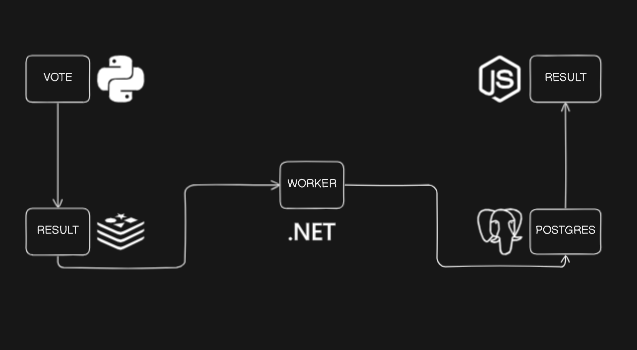
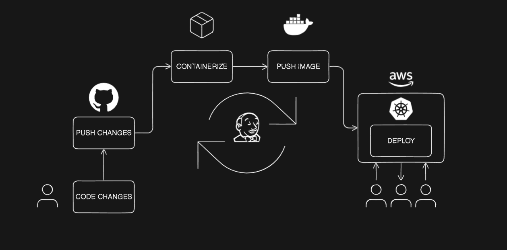
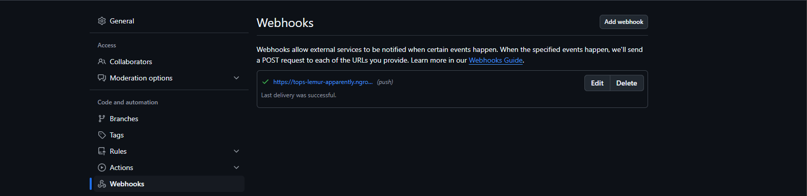
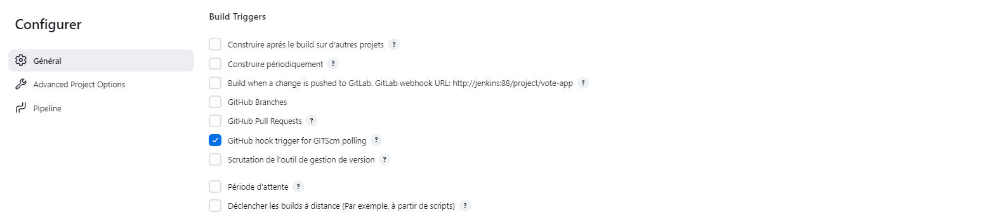
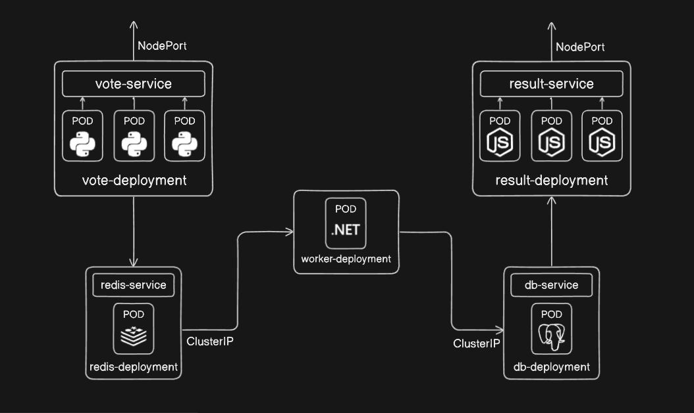
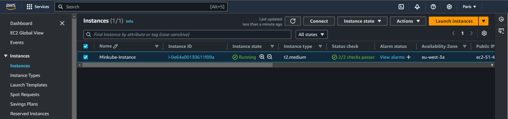
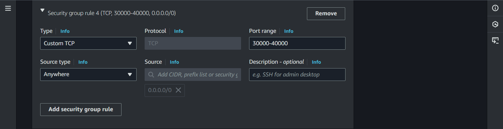
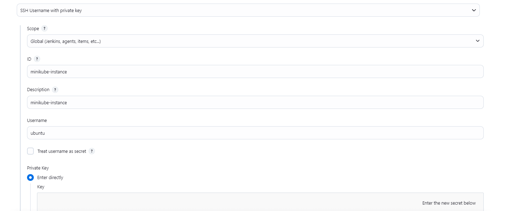
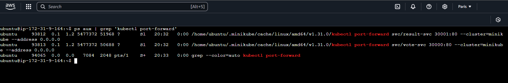

# Vote-App

<a href="https://github.com/dockersamples/example-voting-app">Based on example-voting-app</a>

- [Prerequisites](#prerequisites)
- [CI/CD Pipeline](#cicd-pipeline-)
  - [CI Pipeline](#ci-pipeline-)
    - [Testing the app using `docker-compose`](#testing-the-app-using-docker-compose-)
    - [Pushing docker images](#pushing-docker-images-)
    - [Webhooks](#webhooks-)
  - [CD Pipeline](#cd-pipeline-)
    - [YAML files templates](#yaml-files-templates-)
    - [Setting up minikube](#setting-up-minikube--)
    - [Deploying the cluster manually](#deploying-the-cluster-manually-)
    - [Using an SSH-agent to deploy the cluster](#using-an-ssh-agent-to-deploy-the-cluster-)
  - [Results](#results-)


* This app is structured into five services, each running in separate containers, and it allows users to cast votes and see results in real-time.
* This porject also includes a Kubernetes setup for running the app in a Minikube cluster
* It also includes job triggers and automated deployment with ssh and scripts



### Prerequisites:

* Docker
* Docker Compose (for testing)
* Minikube
* jenkins (as a container)

### Architecture/Containers :

* vote service - Flask based web app (vote)
* Result Service - Node.js app (view results)
* Worker Service - .NET service (processes votes)
* db service - PostgreSQL (store votes)

# CI/CD Pipeline :



## CI Pipeline :

### Testing the app using `docker-compose` :

* using the Docker files <a href="./docker-compose.yml">view file here</a> :
  - docker compose up --build
* using the docker images from DockerHub <a href="./docker-compose-images.yml">view file here</a> :
  - docker compose up -f ./docker-compose-images.yml up

### Pushing docker images :

* Pushing vote ,result & worker to docker hub using <a href="./jenkinsfile">JenkinsFile</a> 
* utilized a <a href="./gs.groovy">Function</a> template to build and push the images 
  - hamdiz0/va-vote:1.0
  - hamdiz0/va-result:1.0
  - hamdiz0/va-worker:1.0
  - redis:alpine (default)
  - postgres:15-alpine (default)

### Webhooks :

* configured a webhook between jenkins and github to trigger the builds automaticly 
  - in the github repo settings there is an option to add webhook trigger
  
    
    
  - make sure to configure jenkins to handle job triggers within a pipline
  
    
    
* more details about web hooks <a href="https://github.com/hamdiz0/LearningDevOps/blob/main/jenkins/jenkins.md#job-triggers">here</a>

## CD Pipeline :

* added kubernetes configuration files to deploy the app on Minikube hosted on an EC2 instance



### YAML files templates :

* utilized deployments for each service 
* configured the vote and result services with a NodePort service-type for easy access from outside the cluster
  - <a href="./k8s-specifications/vote-deployment_svc.yml">vote.YAML</a>
  - <a href="./k8s-specifications/result-deployment_svc.yml">result.YAML</a>
* configured the db(postgres) and redis services with a ClusterIP service-type for an efficient comminication inside the cluster
  - <a href="./k8s-specifications/redis-deployment_svc.yml">redis.YAML</a>
  - <a href="./k8s-specifications/postgres-deployment_svc.yml">postgres.YAML</a>
* no need to configure a service for the worker as it only forwards requests
  - <a href="./k8s-specifications/worker-deployment.yml">worker.YAML</a>

### Setting up minikube  :

  * follow instructions <a href="https://minikube.sigs.k8s.io/docs/start/?arch=%2Fwindows%2Fx86-64%2Fstable%2F.exe+download">here</a>

### Deploying the cluster manually :

  * you can run the script : <a href="./k8s-specifications/minikube-run.sh">minikube-run.sh</a>
  * alternativly you can use this script : <a href="./k8s-specifications/k8s-cluster-run.sh">cluster-run.sh</a> to run it on a kubeadm setup
    - here is guide to how to setup a k8s cluster with vagrant and kubeadm <a href="https://github.com/vancanhuit/vagrant-k8s">vagrant-k8s</a>
  * make sure execute permissions are added and pass in the version "-v" (1.0 , 2.0 , latest) :
    ```
    chmod +x minikube-run.sh -v 2.0
    ```
### Using an SSH-agent to deploy the cluster :

  * create an EC2 instance or setup minikube locally :
    
  * make sure to allow http ,https and ssh and add custom ports if needed :
    
  * install the "ssh agent" plugin in jenkins :
  * generate an ssh key in the remote machine running minikube :
    ```sh
      ssh-keygen
    ```
  * copy the private key of the remote machine in the "Private Key" field when creating an "SSH Username with private key" credential in jenkins :
    - in the home directory of the remote machine:
      ```
      ls .ssh
      ```
      
  * genrate an ssh key in jenkins container 
      ```sh
      docker exec -it <jenkins container Id> bash
      ssh-keygen
      ```
  * make sure to copy the public key of jenkins to the authorized_keys file of the remote machine :
    ```
    nano .ssh/authorized_keys
    ```
  * utilized a function that uses the ssh agent to run a deployment script in the remote machine :
    - <a href="./gs.groovy">see function here</a>
    - here is an example of using the function in a stage
    ```
    gs.deploy(
      'ubuntu',                                           // remote user name
      '51.44.12.190',                                     // Ip address of the remote machine
      '2.0',                                              // version
      'minikube-instance',                                // credentail Id in jenkins (SSH Username with private key)
      'https://github.com/hamdiz0/vote-app.git',          // git repositry
      'vote-app/k8s-specifications/',                     // Repo_Name/Path/ (path to the deployment script in the git repo)
      'minikube-run.sh'                                   // Deployment_Script_Name (in the specified path above)
    )
    ```
    - the function clones the repository and runs the deployment script in the minikube machine
    - than it passes the version to the deployment script as it accept a version option `-v`
  * deployment script :
    - <a href="./k8s-specifications/minikube-run.sh">view the deployment script here</a>
    - the deployment script changes the docker image version in the YAML files than applies them all using a `for` loop
    - the YAML file cantains the docker images along with a place-holder `<<VERSION>>` the script changes this to the passed in version
      ```
      spec:
      containers:
        - name : vote
          image: hamdiz0/va-vote:<<VERSION>> 
          ports :
          - containerPort: 80
      ```
    - the script changes the `<<VERSION>>` with the passed in version throught this command :
      ```
      sed -i "s/<<VERSION>>/${VER}/" "$file" # VER contains the values of the passed in version
      ```
    - the script than forwards both the vote and result services ports so we can access them using the public ip of the EC2 instance :
      ```
      minikube kubectl -- port-forward svc/vote-svc 30000:80 --address 0.0.0.0 &
      minikube kubectl -- port-forward svc/result-svc 30001:80 --address 0.0.0.0 &
      ```
      * these commands will keep the script in an continious execution mode wish causes the jenkins job to never end 
      * the forwarding processes must be seperated from the script by capturing their PIDs and disowning from the script :
        ```
        minikube kubectl -- port-forward svc/vote-svc 30000:80 --address 0.0.0.0 &
        VOTE_PID=$!  # get port forwarding proccess id
        disown $VOTE_PID # seperate the process from the script
        ```
      * these processes can also cause problems when you want to deploy again (port is in use error) :
        
      * they must be killed before reusing the ports again for the next deployment :
        ```
        kill $(ps aux | grep 'kubectl port-forward' | awk '{print $2}')
        ```
    - the vote and result services are accessable throught :
      * http://<Public_IP@_of_the_EC2_Instance>:30000
      * http://<Public_IP@_of_the_EC2_Instance>:30001

### Results :

  #### Kubectl get svc,deploy,pods :

  

  #### Jenkins build result :

  

## Checkout my <a href="https://github.com/hamdiz0/LearningDevOps">LearningDevops</a> repo for more details about these tools and devops in general do not hesitate to contribute
